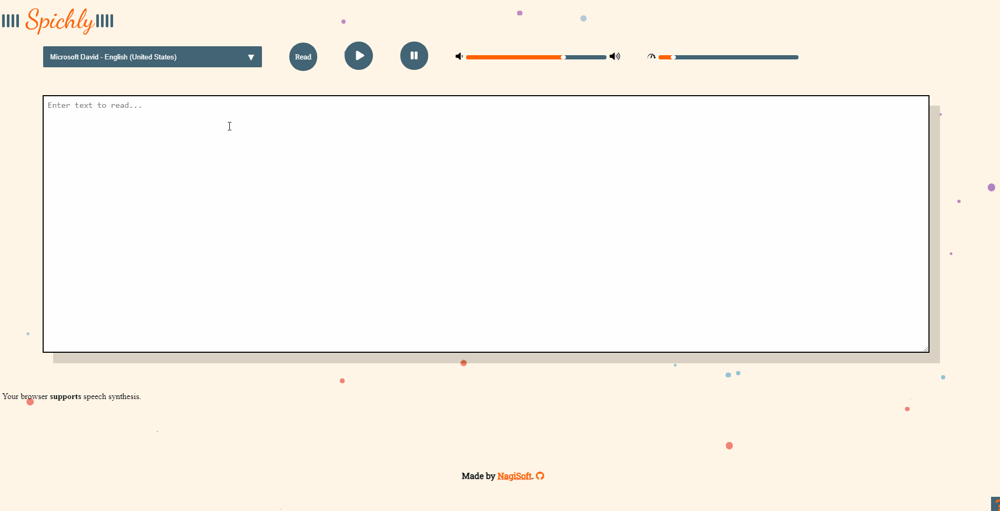

## Spichly

Spichly is a Text-to-Speech application made using javascript and the Speech Synthesis API.

- [Demo Website Spichly](https://nagisoft.github.io/spichly/)

## Screenshots

### Screenshots

## Features

Features Done :

- [x] Text To Speech using different voices and languages
- [x] Resume/Pause
- [x] Animated visualizer on Logo
- [x] Volume and Speed controls
- [x] About (Little ? on the right bottom of the page)
- [x] Browser Support

Todo :

- [ ] Improve App on page change
- [ ] Speech to MP3 Download
- [ ] Read Text from Uploaded Files

## Built With

- HTML/CSS
- Vanilla JavaScript + JQuery
- Speech Synthesis API

## Author

**Bensaad Soukaina**

- [Linkedin](https://www.linkedin.com/in/soukaina-bensaad/ "Linkedin")

## Ressources

I got some design inspiration on some elements from Codepen (Linked in file Comments) :

- [Fontawesome](https://www.fontawesome.com/ "Fontawesome")
- [Codepen](https://codepen.io/trending "Codepen")

## Support

Contributions, issues, and feature requests are welcome!

Give a ⭐️ if you like this project!

## License

Distributed under the GNU AGPLv3 License. See `LICENSE` File for more information.
